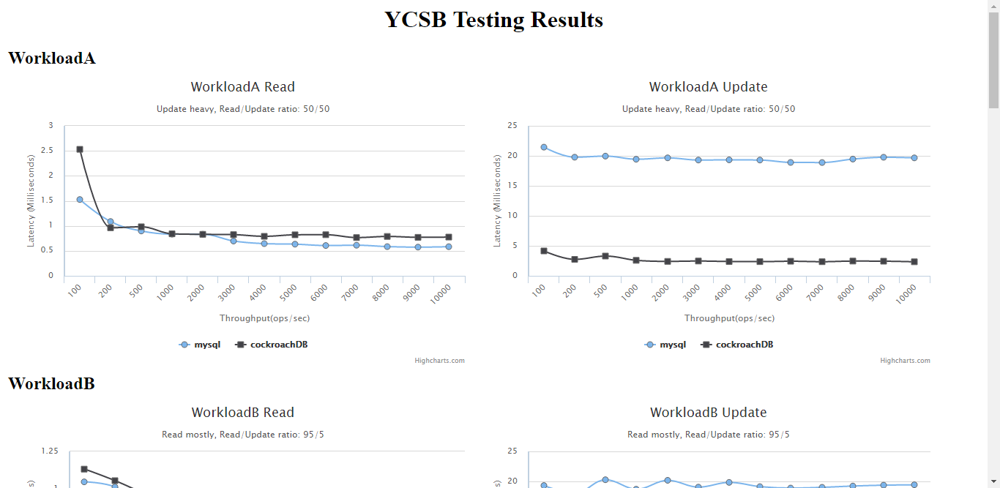

# ycsb2graph

To generate visualize graph from ycsb testing results

## Usage

	./ycsb2graphV2.sh [resultsDir]...
	
example:

	./ycsb2graphV2.sh ../ycsb_starter/Results.cockroachDB.20160830_143458 ../ycsb_starter/Results.mysql.20160830_143501

	
## Filename requirement

It only have filename requirement, it need to follow the giving rule ( use dash to separate, with suffix .result )

	dbname-workloadname-operationcount.result

Example:

	CockroachDB-WorkloadA-100.result

For all demo graph, see  [example](example)

The demo's results is provided by ycsb_starter, For more info about ycsb_starter, see [ycsb_starter](https://github.com/chinglinwen/ycsb_starter)

end.